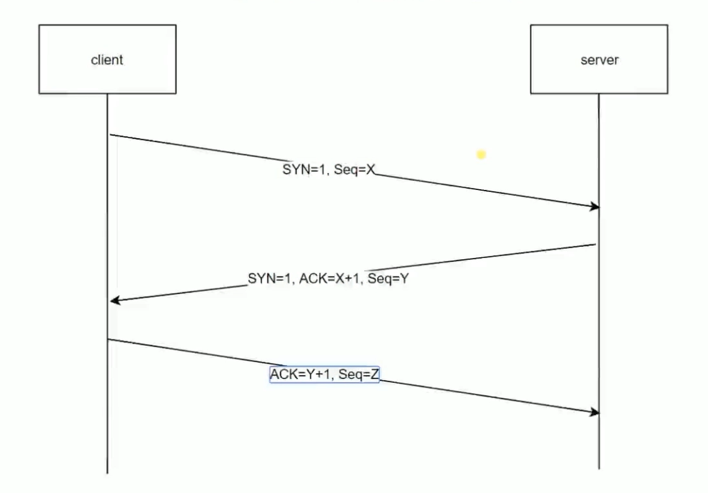

http
====

HTTP
----

### HTTP的发展历史

#### HTTP/0.9

1.	只有一个命令GET
2.	没有HEADER等描述数据的信息
3.	服务器发送完毕会关闭TCP连接

#### HTTP/1.0

1.	增加了很多新命令，比如post
2.	增加status code和header
3.	多字符集支持、多部分发送、权限、缓存等

#### HTTP/1.1

1.	持久连接（性能大幅度提升）
2.	pipeline（一次可以发送多个请求—串行排队模式）
3.	增加host和其他一些命令

#### HTTP/2

1.	所有数据以二进制传输
2.	同一个连接里发送多个请求不再需要按照顺序来（并行无需排队）
3.	头信息（比如header）压缩以便减少带宽的使用和推送（HTML、CSS、js文件并行推送到客户端）等提高效率的功能

#### HTTPS

-	和HTTP/1.1类似，只是一个安全版本的HTTP

### HTTP的一些概念

-	HTTP是约束**客户端**和**服务端**的一个协议
-	HTTP协议中包含如何发出请求和如何进行响应（数据包）
-	HTTP不存在连接的概念
-	HTTP发出请求的时候会和服务端创建一个TCP连接

### HTTP的三次握手



> 首先客户端向服务端发出请求其中包括SYN=1标志位（创建请求的数据包）和Seq=X.
>
> 服务端收到请求数据包创建TCP连接，并开启一个端口，同时返回SYN=1标志位，ACK=X+1(Seq的值+1)，Seq=Y（服务端的Seq）
>
> 客户端接收后表明服务端已经收到之前发送的请求了并且已经创建好TCP连接了，于是回复ACK=Y+1,Seq=Z

#### 为什么需要三次握手

-	避免创建无用的TCP连接

-	可以让服务端得知客户端是否已经收到了响应

-	规避由于网络延迟造成的不必要的服务器开销问题

### 约定内容

-	请求/响应报文格式
-	请求方法——GET/POST/etc.
-	响应状态——200/404/302/304/etc.
-	预设的请求/响应头

### 请求报文

每次请求需要包含三个部分，分别是请求行、请求头、请求体

-	请求行（GET /路径 HTTP/1.1）

-	请求头在请求行之下，格式为键值形式

-	当请求方式为GET时，请求体为空（参数通过在请求行中的请求地址传递），当方式为POST时，请求体为提交的参数

### 响应报文

每次响应都包含三个部分，分别是状态行、响应头、响应体

-	状态行（HTTP/1.1 200 OK）

-	响应头和请求头类似

-	在chrome浏览器中响应体在Response中，其内容就是请求的文件的内容（比如请求一个css文件，内容就是这个css文件的全部代码）如果请求的是一张图片，可以在preview中预览图片

Cookie
------

1.	http协议是一个无状态（没脑子）的协议，因为Apache不会记录曾经谁来访问过。举例：登陆后刷新需反复验证登陆信息。

2.	Http的会话机制是用来解决这个问题的新技术，其主要构成是Cookie。

3.	注：Cookie不是实现登录的唯一方案

4.	Cookie的创建和记录都在客户端（浏览器）中完成。

### 如何创建和读取Cookie

-	通过document.cookie进行设置
-	Cookie的本质就是一个带有格式的字符串，格式：key=val;key1=val1;.....

```javascript
    //设置cookie(需多次创建)
    document.cookie = 'name=xiaoming';
    document.cookie = 'age=16';
    //读取cookie
    console.log(document.cookie);
```

-	读取cookie可以通过浏览器的Application中的Cookies中查看

### Cookie的一些特点

1.	Cookie是有"寿命"的
	-	默认关闭浏览器时清除
	-	在设置cookie的同时可以对其到期时间进行设置

```javascript
        document.cookie = 'name=xiaoming;expires='+ new Date('2018-06-10');
    ```
2. Cookie是有访问权限的
  * 当设置了cookie只能当前路径或者子路径可以访问
  * 可以对默认访问的路径进行修改
  ```javascript
    document.cookie = 'name=xiaoming;path=/'
```

1.	Cookie有大小限制约为4kb

### Cookie的完整设置

```javascript
  document.cookie = 'age=16;path=/;expires'+ new Date('2018-12-01');
```

### Cookie的解析

```javascript
  //原生js解析cookie
  document.cookie = 'name=xiaoming';
  document.cookie = 'age=16';
  var cookie = document.cookie;
  var arr = cookie.split(';');
  var o = {};
  for(var i = 0;i<arr.length;i++){
    var tmp = arr[i].split('=');
    o[tmp[0]] = tmp[1];
  }
```

---

```javascript
  //jQuery插件解析cookie
  <script src='引入jQuery'><script>
  <script src='引入jQuery-cookie插件'><script>
  //1设置
  $.cookie('age',16);
  $.cookie('name','xiaoming');

  //2完整设置
  $.cookie('gender','female',{
    path:'/',
    expires:7
  });

  //读取cookie
  console.log($.cookie('name'));

  //删除
  $.removeCookie('name',{
    path:'/'
  })
```
